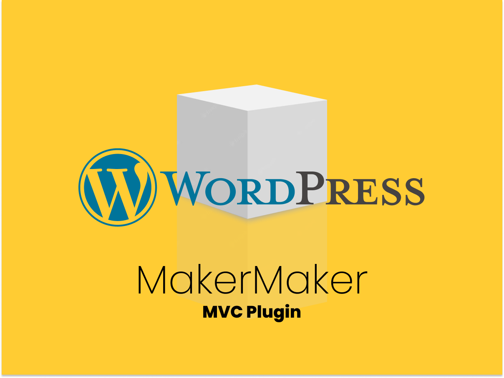

# MakerMaker



MakerMaker is a GPL-3.0-or-later WordPress plugin that generates structured custom plugins from the **official scaffold in an installed TypeRocket Pro v6 package**.

It does not bundle TypeRocket Pro, license keys, Galaxy executables, or copied global `app`, `config`, `resources`, and `routes` trees. TypeRocket Pro v6 remains a separately installed private dependency.

## Requirements

- WordPress 6.5+
- PHP 8.2+
- TypeRocket Pro v6 installed and loaded
- Write access to `WP_PLUGIN_DIR`

MakerMaker resolves infrastructure dynamically:

- its own repository from `MAKERMAKER_PATH` (with legacy MU-plugin loader compatibility);
- TypeRocket from the runtime `TYPEROCKET_PATH` constant;
- the official scaffold below TypeRocket's installed Professional package;
- generated plugins under WordPress's `WP_PLUGIN_DIR`.

No absolute site, container, MU-plugin, or TypeRocket repository path is embedded.

## Project workspace

Treat `wp-content/plugins/makermaker/` as replaceable core. Generate project domain code into a sibling plugin, normally `wp-content/plugins/<site>-app/`; additional bounded-domain sibling plugins are allowed. Generated plugins own their models, controllers, fields, policies, resources, views, routes, migrations, assets, and tests.

MakerMaker may improve future scaffolds but never rewrites an existing generated plugin. Existing generated plugins remain separate and continue to boot when MakerMaker is disabled, subject to their own TypeRocket dependency. Do not put project code or a `custom/` directory in this checkout. See [CORE-BOUNDARY.md](CORE-BOUNDARY.md) for ownership and compatibility policy.

## Git worktree workflow

The playground checkout is this repository's clean **primary worktree** and stays on `main`. For parallel generator work, create a linked feature worktree outside WordPress:

```bash
git worktree add "$HOME/projects/worktrees/makermaker/generator-change" \
  -b feat/generator-change
```

Develop, lint, test, and commit there. Then merge from the playground primary worktree and remove the temporary checkout:

```bash
git switch main
git pull --ff-only
git merge feat/generator-change
composer lint
composer test
git worktree remove "$HOME/projects/worktrees/makermaker/generator-change"
git branch -d feat/generator-change
```

A branch can be checked out in only one worktree. Use `git worktree list` to inspect active checkouts. Generated site/domain code belongs in sibling plugins, not a core feature worktree. Merge reviewed generator changes to primary `main` before the Maker release flow.

## Installation

Install MakerMaker as a regular plugin and activate it after TypeRocket Pro is available:

```bash
git clone git@github.com:prospect-ogujiuba/makermaker.git \
  wp-content/plugins/makermaker
wp plugin activate makermaker
```

DevArch performs this through its `github-plugin makermaker` profile directive. The entry loader retains compatibility with older MU-plugin installations, but regular-plugin installation is the supported contract.

## Admin workflow

Open **Tools → MakerMaker**, enter the plugin name, slug, PHP namespace, and Composer vendor, then generate. Activation is opt-in.

## WP-CLI workflow

```bash
wp makermaker create client-portal \
  --name="Client Portal" \
  --namespace='Maker\\ClientPortal' \
  --vendor=prospect

# Explicitly activate after generation:
wp makermaker create inventory-tools \
  --name="Inventory Tools" \
  --namespace='Maker\\InventoryTools' \
  --activate
```

Generated plugins remain in `wp-content/plugins/<slug>` and use TypeRocket's `BasePlugin` lifecycle, migrations, routes, policies, settings, assets, and views. Each plugin also receives a root `galaxy_<plugin_key>` launcher and `galaxy-<plugin-slug>-config.php`. The portable config targets that plugin's app, resources, routes, storage, views, migrations, and PHP namespace without embedding host/container paths or assuming `wp-content/plugins`/a particular TypeRocket repository directory. It discovers regular and MU-plugin layouts beneath the WordPress root and validates TypeRocket markers before initialization. Nonstandard or external layouts can set `MAKERMAKER_GALAXY_WORDPRESS_ROOT`, `MAKERMAKER_GALAXY_PLUGIN_PATH`, and `MAKERMAKER_GALAXY_TYPEROCKET_PATH`.

```bash
php galaxy_inventory_tools list
php galaxy_inventory_tools make:model base Product
php galaxy_inventory_tools make:controller base ProductController
php galaxy_inventory_tools make:migration create_products
php galaxy_inventory_tools make:maker-resource Product --migration --tests
php galaxy_inventory_tools migrate up
```

Inside the plugin launcher, `make:maker-resource` infers the plugin slug and namespace. The global site launcher continues to require explicit `--plugin` and `--namespace`.

MakerMaker owns its canonical launcher and portable config at `galaxy/galaxy_makermaker` and `galaxy/galaxy-makermaker-config.php`. Installation deploys byte-identical copies to the WordPress root (with launcher mode `0755`); the repository remains the source of truth.

Existing plugins can receive the same context safely:

```bash
wp makermaker register-plugin-galaxy \
  --plugin=makermaker --namespace=Maker/MakerMaker
```

Identical launcher/config files are treated as already registered. Partial, symbolic, or different destinations are refused and never overwritten. DevArch profiles backfill MakerMaker's plugin-specific launcher automatically.

## MVC resource generation

Generate a safe resource inside an existing plugin with WP-CLI:

```bash
wp makermaker resource Product \
  --plugin=inventory-tools \
  --namespace='Maker\\Inventory' \
  --plural=products \
  --migration --views --factory --tests
```

The matching Galaxy command is:

```bash
php galaxy make:maker-resource Product \
  --plugin=inventory-tools \
  --namespace='Maker/Inventory' \
  --plural=products \
  --migration --views --factory --tests
```

Galaxy accepts slash-separated namespaces to avoid console escaping and normalizes them to PHP namespace separators. MakerMaker registers `make:maker-resource` at runtime through TypeRocket's `typerocket_galaxy_commands` filter. No TypeRocket configuration mutation or separate registration command is required.

Galaxy must load WordPress (the TypeRocket default), so MakerMaker and `WP_PLUGIN_DIR` are available. Both commands accept a plugin **slug**, never an absolute path. The namespace is always explicit.

Every resource includes:

- `app/Models/<Name>.php`
- `app/Controllers/<Name>Controller.php`
- `app/Http/Fields/<Name>Fields.php`
- `app/Auth/<Name>Policy.php` (deny-by-default)
- an entry in the generated `config/makermaker-resources.php` registry
- an immediately registered TypeRocket admin resource menu with editable title, icon, position, and administrator capabilities

New MakerMaker-generated plugins include a namespace-local `ResourceRegistrar` and explicitly load the registry after TypeRocket initializes. Existing plugins must add the same explicit registrar call once; MakerMaker itself provides the reference integration in `MakermakerTypeRocketPlugin::init()`.

`--migration` creates a timestamped TypeRocket SQL migration with explicit Up/Down sections and `{!!prefix!!}` table tokens. Generation does not modify the database: run `php galaxy_<plugin_key> migrate up` from the WordPress root before using the resource. Both resource commands print this required next step. `--views` creates a working `tr_table()` index plus a `tr_tabs()`/fieldset form, while the generated controller provides the matching index/add/create/edit/update/show/delete/destroy actions and namespace-local `View`. `--factory` and `--tests` add their named test layers. Common `-y` and sibilant plurals are inferred (`categories`, `addresses`); use `--plural=<lowercase_snake_case>` for irregular or contract-sensitive resource/table names. MakerMaker does not use glob discovery, reflection, inferred domains, or implicit API exposure.

## Core development

```bash
composer test
composer lint
```

The tests use a synthetic official-shaped fixture; no TypeRocket Professional source is committed.

## Security model

- Admin generation requires `install_plugins` and a valid nonce.
- Slugs and PHP namespaces are strictly validated.
- Destination paths are contained under `WP_PLUGIN_DIR`.
- Existing plugins are never overwritten.
- Official-template symbolic links are rejected.
- Whole-plugin generation locks the WordPress root and publishes the plugin directory plus executable plugin-specific Galaxy launcher/config in one staged, collision-preflighted, rollback-safe transaction.
- Resource generation locks the target plugin, stages every file, preflights all collisions, publishes the registry last, and rolls back failures.
- Resource generation accepts only a direct, non-symbolic plugin child of `WP_PLUGIN_DIR` and never overwrites generated files.
- No shell command, glob/reflection discovery, domain catalog, or GitHub API is used.
